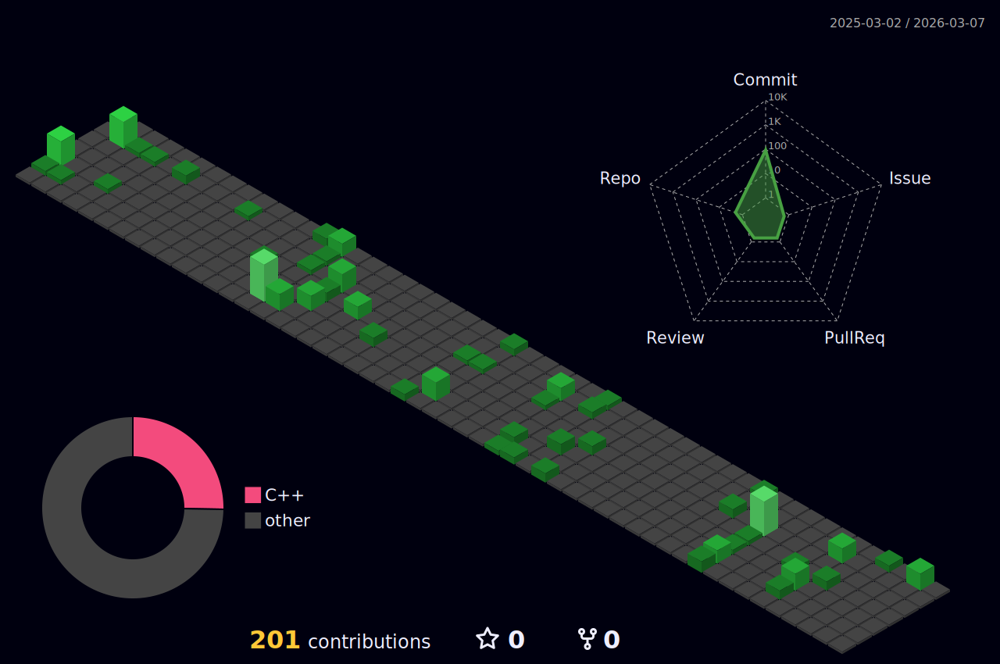

## Hi there 👋

<!--
**badb0ttle/badb0ttle** is a ✨ _special_ ✨ repository because its `README.md` (this file) appears on your GitHub profile.

Here are some ideas to get you started:

- 🔭 I’m currently working on ...
- 🌱 I’m currently learning ...
- 👯 I’m looking to collaborate on ...
- 🤔 I’m looking for help with ...
- 💬 Ask me about ...
- 📫 How to reach me: ...
- 😄 Pronouns: ...
- ⚡ Fun fact: ...
-->


<picture>

</picture>

<!--START_SECTION:waka-->


**🐱 My GitHub Data** 

> 📦 401.3 kB Used in GitHub's Storage 
 > 
> 🏆 217 Contributions in the Year 2025
 > 
> 🚫 Not Opted to Hire
 > 
> 📜 4 Public Repositories 
 > 
> 🔑 6 Private Repositories 
 > 
**I'm an Early 🐤** 

```text
🌞 Morning                47 commits          ███░░░░░░░░░░░░░░░░░░░░░░   11.75 % 
🌆 Daytime                197 commits         ████████████░░░░░░░░░░░░░   49.25 % 
🌃 Evening                114 commits         ███████░░░░░░░░░░░░░░░░░░   28.50 % 
🌙 Night                  42 commits          ███░░░░░░░░░░░░░░░░░░░░░░   10.50 % 
```
📅 **I'm Most Productive on Monday** 

```text
Monday                   117 commits         ███████░░░░░░░░░░░░░░░░░░   29.25 % 
Tuesday                  96 commits          ██████░░░░░░░░░░░░░░░░░░░   24.00 % 
Wednesday                59 commits          ████░░░░░░░░░░░░░░░░░░░░░   14.75 % 
Thursday                 27 commits          ██░░░░░░░░░░░░░░░░░░░░░░░   06.75 % 
Friday                   68 commits          ████░░░░░░░░░░░░░░░░░░░░░   17.00 % 
Saturday                 17 commits          █░░░░░░░░░░░░░░░░░░░░░░░░   04.25 % 
Sunday                   16 commits          █░░░░░░░░░░░░░░░░░░░░░░░░   04.00 % 
```


📊 **This Week I Spent My Time On** 

```text
🕑︎ Time Zone: Asia/Shanghai

💬 Programming Languages: 
Vue.js                   3 hrs 41 mins       ███████░░░░░░░░░░░░░░░░░░   28.86 % 
Markdown                 3 hrs 8 mins        ██████░░░░░░░░░░░░░░░░░░░   24.59 % 
Python                   2 hrs 37 mins       █████░░░░░░░░░░░░░░░░░░░░   20.45 % 
JSON                     1 hr 10 mins        ██░░░░░░░░░░░░░░░░░░░░░░░   09.15 % 
Text                     29 mins             █░░░░░░░░░░░░░░░░░░░░░░░░   03.89 % 

🔥 Editors: 
Trae                     12 hrs 14 mins      ████████████████████████░   95.58 % 
Cursor                   33 mins             █░░░░░░░░░░░░░░░░░░░░░░░░   04.42 % 

🐱‍💻 Projects: 
LeZu                     5 hrs 5 mins        ██████████░░░░░░░░░░░░░░░   39.79 % 
python                   3 hrs 26 mins       ███████░░░░░░░░░░░░░░░░░░   26.89 % 
面试题(1)                   2 hrs 20 mins       █████░░░░░░░░░░░░░░░░░░░░   18.33 % 
SWE23031黄俊华              58 mins             ██░░░░░░░░░░░░░░░░░░░░░░░   07.64 % 
sky-take-out             17 mins             █░░░░░░░░░░░░░░░░░░░░░░░░   02.29 % 

💻 Operating System: 
Mac                      12 hrs 48 mins      █████████████████████████   100.00 % 
```

**I Mostly Code in HTML** 

```text
HTML                     2 repos             ████████░░░░░░░░░░░░░░░░░   33.33 % 
C++                      2 repos             ████████░░░░░░░░░░░░░░░░░   33.33 % 
Vue                      1 repo              ████░░░░░░░░░░░░░░░░░░░░░   16.67 % 
JavaScript               1 repo              ████░░░░░░░░░░░░░░░░░░░░░   16.67 % 
```


 Last Updated on 29/12/2025 18:51:56 UTC
<!--END_SECTION:waka-->

